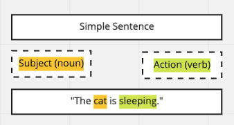
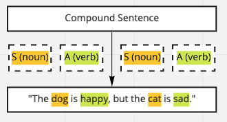

# create-enlish-sentences

This app is aimed to help people learn English by forming sentances.

## Getting Started

To run this application after cloning the repo do the following:

```sh
$ yarn install
$ yarn start
```


## Technology Stack

The following is the technology used for this application.

1. Language: TypeScript
2. Framework: React.JS
3. Design System: Material-UI


## Design

The following is the idea around the functional design of the application, since a sentence can be broken down into smaller pieces, the first step was to identify what makes up a sentence.

An English sentence can be defined categorized into one of the following:

1. Simple sentence
2. Compound sentence
3. Complex sentence

### Simple Sentence

These two items make up a sentence.

1. Subject (a noun)
2. Action (a verb)

The following diagram shows how a *simple* sentence is constructed:



> Simple sentence has only *one* clause

### Compound Sentence

The following diagram shows how a *compound* sentence is constructed:



> Compound sentence has *two* or more clauses


### Complex Sentence

A complex sentence can be broken down into one clause with a relative clause.

> Complex sentence has *one* clause with a *relative* clause

## Application Design

The following outlines the design of the application that was created. In trying to keep the UI as simple was possible my first thought was to make it as elementry as possible. If there was more time and more detailed design requirements the application could been styled to resemble a "School Assignment" or "Childlike" look and feel to make it more approachable.

## Components

The following components were created as a way to follow the seperation of concerns.

The components logic is broken down into the following:

1. `InputForm` - This is a simple form for users to input a subject, noun, and tense.
2. `OutputForm` - This is a simple component that uses Hooks to handle fetching the complete sentence from the backend and rendering it to the display.
3. `ApiService` - This is a simple service class that handles making a API request then caching, then returns the results.

### Data

For assisting users in completing the form I gathered data from around the internet about the most commonly used nouns and verbs. This data is loaded and populates the autocomplete inputs in the UI.