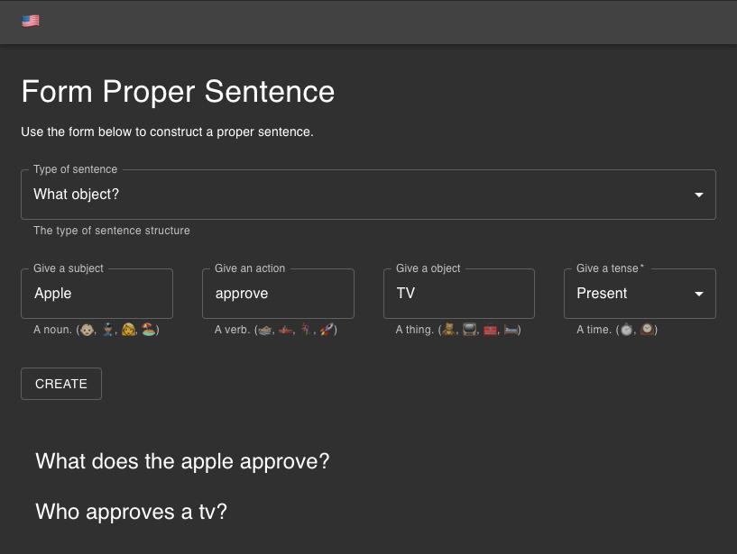

# create-english-sentences

This app is to help people learn English by forming proper sentences.

You can view of this application running [here](https://jonniespratley.github.io/create-english-sentences/)


## Getting Started

To run this application after cloning the repo do the following:

```sh
$ yarn install
$ yarn start
```

## Requirements

Create a simple web application that allows users learning English to form proper sentences.

 - [x] Use Linguatools free testing API to generate sentences

Allow users to:

- [x] Choose a sentence type
- [x] Give a noun as a subject
- [x] Give a verb
- [x] Give a noun as an object
- [x] Choose a verb tense


## Technology Stack

The following is the technology used for this application.

1. Language: TypeScript
2. Framework: React.JS
3. Design System: Material-UI


--- 

## Design Breakdown

The following is the idea around the functional design of the application, since a sentence can be broken down into smaller pieces, the first step was to identify what makes up a sentence.

An English sentence can be defined categorized into one of the following:

1. Simple sentence
2. Compound sentence
3. Complex sentence

### Simple Sentence

These two items make up a sentence.

1. Subject (a noun)
2. Action (a verb)

The following diagram shows how a *simple* sentence is constructed:


> Simple sentence has only *one* clause

### Compound Sentence

The following diagram shows how a *compound* sentence is constructed:


> Compound sentence has *two* or more clauses


### Complex Sentence

A complex sentence can be broken down into one clause with a relative clause.


> Complex sentence has *one* clause with a *relative* clause

---

## Application Design

The simple sentence type is what was focused on due to time constraints.
The application was broken down into the following layers.

### User Interface Layer

1. `InputForm` - This is a simple form for users to input a subject, noun, and tense.
2. `SentenceOuput` - This is a simple component that uses Hooks to handle fetching the complete sentence from the API and rendering it to the display.

  > Note: This is not used in this demo, see pros & cons.

### Data Access Layer

1. `ApiService` - This is a simple service class that handles making a API request then caching, then returns the results.

## User Interface

Since it takes two things to make a sentence (subject, verb) I wanted to make the inputs be grouped as two. This can enable extension of complex and compound sentences as two more groups (subject, verb) could make up different sencences.

In this case a simple sentence is captured:



Below the form is the list of sentences that were generated, if you press on a item it will speak that sentence to you.

## Pros & Cons

To follow up on the design trade offs with the UI.

- Data fetching - This could be done in the react component during the render. But it was moved to the application layer for usablity.
- Form inputs - This could have been something easier for a user to input data into. Such as cards or big icons.
- Sentence Output - This was going to be big letters to show the sentence, but was moved to a smaller list with history.

## Conclusion

The objective was challenging when you think about the design aspect.

When you start breaking down the different parts of a sentence and a user entering data, my initial thought was to keep it extremely basic.

If there was more time and more detailed design requirements the application could been styled to resemble a "School Assignment" or "Childlike" look and feel to make it more approachable.